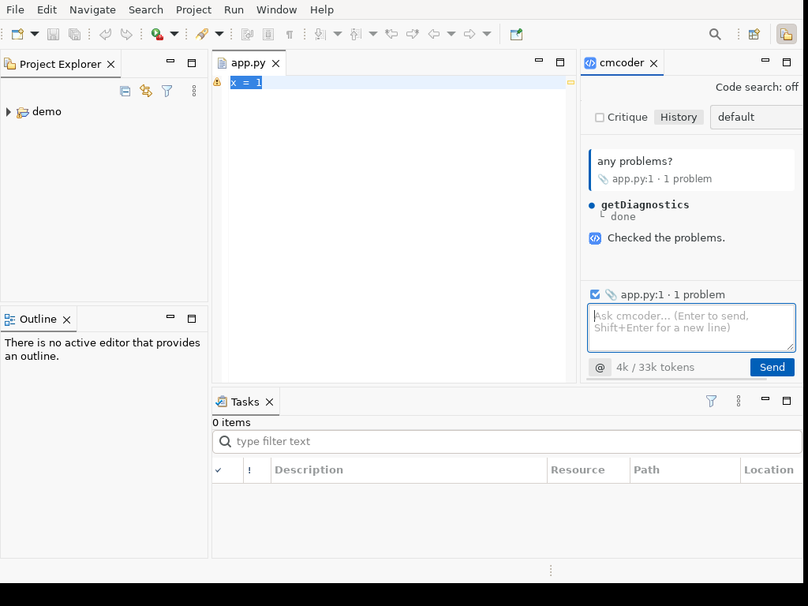
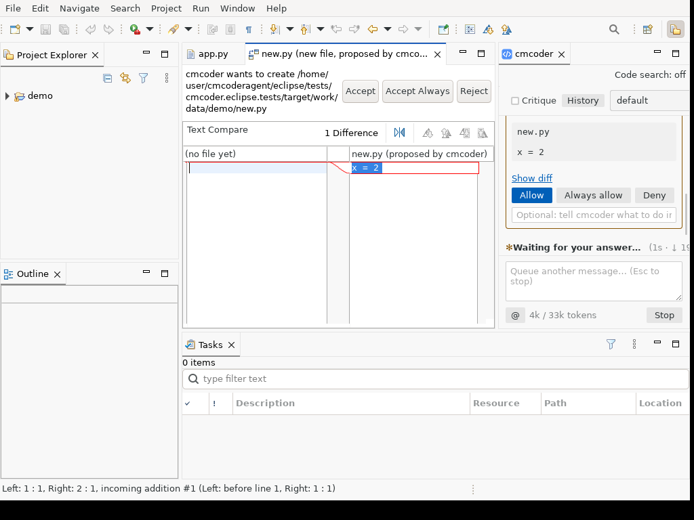
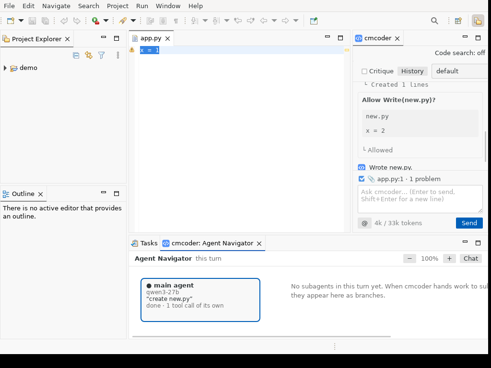

# cmcoder for Eclipse: install and use

The Eclipse plugin is **one `.zip` file** (an update site) for Windows, macOS
and Linux, with cmcoder inside. You don't need Python or the terminal
package.



## What you need

| | |
|---|---|
| Eclipse | **2024-06 or newer**, any package (Java, C/C++, Enterprise…), running on **Java 21** |
| Windows | **Git for Windows** (cmcoder runs commands with Git Bash); the **Microsoft Edge WebView2 Runtime** shows the chat (part of Windows 11 and Edge) |
| Linux | **WebKitGTK** shows the chat: `sudo apt install libwebkit2gtk-4.1-0` (or your distribution's package) |
| Network | access to your company's AI gateway (often: the VPN) |
| From your AI team | the gateway address, the model name, your API key |

## 1. Get the file

**`cmcoder-eclipse`** (a `.zip`). It's one file for every platform. Your team
shares it, or on GitHub go to **Actions → Release build →** the latest green
run **→ Artifacts**. GitHub wraps it in another `.zip`: unzip that once to get
the update site zip. **Don't unzip the update site itself.**

## 2. Install

1. **Help → Install New Software…**
2. **Add… → Archive…**, choose the `cmcoder-eclipse` zip, name it `cmcoder`,
   **Add**.
3. Tick **cmcoder**, then **Next**, **Next**, accept the license, **Finish**.
4. Eclipse warns that the content is unsigned (until your company signs it):
   **Install Anyway**.
5. **Restart Now** when asked.

## 3. First-time setup (once)

Skip this if your team did it for you: open the chat and ask something. If it
answers, you're done.

1. **The gateway.** Create `%USERPROFILE%\.cmcoder\settings.json` (Windows) or
   `~/.cmcoder/settings.json` (macOS, Linux) with what your AI team gives you:

   ```json
   {
     "providers": { "corp": { "baseUrl": "https://ai-gateway.example.com/v1" } },
     "model": "corp:qwen3-27b"
   }
   ```

2. **Your API key.** It's saved in your operating system's keychain, never in
   a file. In Eclipse, press **Ctrl+3**, run **cmcoder: Copy Diagnostics**, and
   paste it somewhere: the **Program:** line is the cmcoder inside the plugin
   (in Eclipse's `plugins` folder, ending in `bin/cmcoder/cmcoder`, or
   `cmcoder.exe` on Windows). In a terminal, run that program with `login` and
   paste your key (it isn't shown):

   ```
   "C:\…\plugins\cmcoder.eclipse.win32.x86_64_…\bin\cmcoder\cmcoder.exe" login
   ```

   If you also use the terminal package, `cmcoder login` there does the same:
   the key is shared.

More (Open WebUI, certificates, proxies): [setup.md](setup.md).

## 4. Use

1. Select a project in the Project Explorer. cmcoder works in it.
2. Press **Ctrl+Alt+J** (Mac: Cmd+Alt+J), or **Window → Show View → Other… →
   cmcoder → cmcoder**. The chat opens on the right.
3. Type what you want and press **Enter** (**Shift+Enter** for a new line).
   For example: "explain this class", "add a JUnit test for parse",
   "any problems in this file?".

cmcoder reads files on its own. **Before it changes a file or runs a command,
it asks you.**

### Review a change

The proposed change opens in Eclipse's compare editor: the file now on the
left, the proposal on the right. Choose **Accept**, **Accept Always** or
**Reject** above it, or answer in the chat: **Allow**, **Always allow** (this
kind of action in this project, from now on) or **Deny** (with a note telling
cmcoder what to do instead).



### Everyday actions

| To | Do |
|---|---|
| Ask about some code | select it, then **Ctrl+Alt+K** (Mac: Cmd+Alt+K) or right-click → **Ask cmcoder About Selection** |
| See what goes with your message | the 📎 line above the input: the open file, the selection and its problems. Untick it to leave them out once |
| Show an image (a screenshot, an error dialog) | **Ctrl+V** in the input, drop the file on the chat, or the **Image** button ([images.md](images.md)) |
| Stop cmcoder | **Esc**, or **Stop** |
| Start over | **Ctrl+3** → **cmcoder: New Conversation** |
| Go back to an earlier conversation | **History** at the top of the chat |
| Change how much it asks | the picker at the top: **default** (ask) / **acceptEdits** / **plan** (read only) |
| A second check of each answer | tick **Critique** at the top |
| See background helpers (subagents) | **Ctrl+3** → **cmcoder: Open Agent Navigator** |
| Search code by meaning (big projects) | **Code search** in the chat view's toolbar ([code-search.md](code-search.md)) |

All commands are under **Ctrl+3**: type "cmcoder".



*The Agent Navigator: the current turn and any helpers it started.*

Closing the chat view stops cmcoder; opening it starts a new one. Your
conversations are kept (**History**).

## Preferences

**Window → Preferences → cmcoder** (Mac: **Eclipse → Settings → cmcoder**):

| Preference | Meaning |
|---|---|
| cmcoder program | **leave empty**: the copy inside the plugin is used |
| Permission mode at start | ask / accept edits / plan (read only) |
| Send the open file, the selection and its problems | (on) |
| Show proposed changes in the compare editor | (on) |
| Use the project's own .cmcoder settings | off; switch on only for projects you trust |

## Update or remove

- **Update:** the same install steps with the new zip.
- **Remove:** **Help → About Eclipse IDE → Installation Details →** cmcoder
  **→ Uninstall**, then restart. Your settings, key and conversations stay in
  `~/.cmcoder`.

## If something's wrong

| Problem | Fix |
|---|---|
| The plugin won't install | Eclipse older than 2024-06, or not running on Java 21 |
| The chat is blank (Windows) | install the Microsoft Edge WebView2 Runtime |
| The chat is blank (Linux) | install WebKitGTK (`libwebkit2gtk-4.1-0`) |
| The program can't start | empty **cmcoder program** in the preferences |
| "Can't reach the gateway" | connect the VPN; check `baseUrl` in your settings file |
| "No API key" / 401 | run `login` again (step 3); keys expire |
| Certificate error | add your company's root certificate: [setup.md](setup.md) |
| Commands fail on Windows: "Git Bash not found" | install Git for Windows, restart Eclipse |

For help, use **Ctrl+3 → cmcoder: Copy Diagnostics** and **cmcoder: Show Log**
(Console view), and send both (your key is never in them). More:
[troubleshooting.md](troubleshooting.md).
