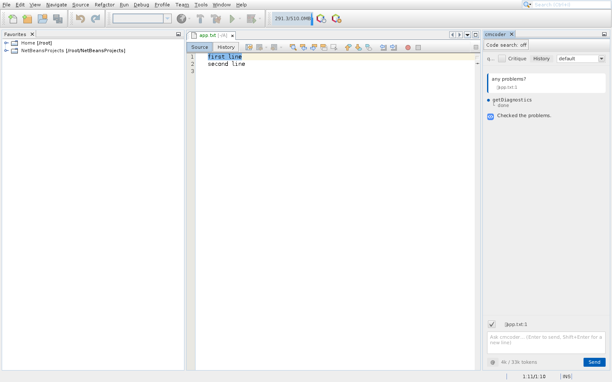
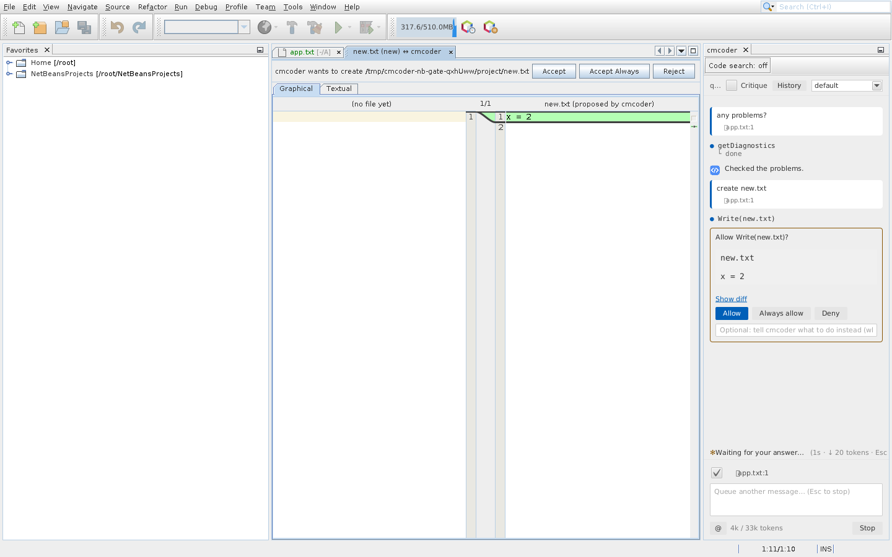
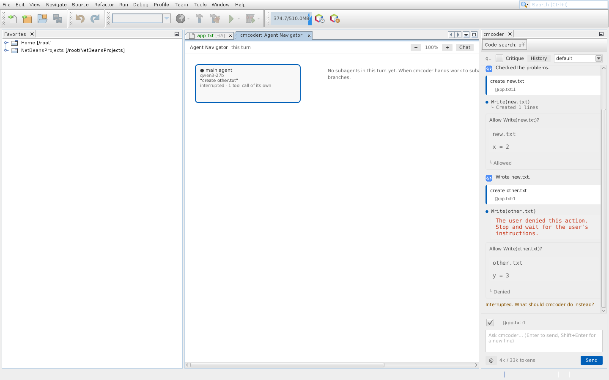

# cmcoder for NetBeans: install and use

The NetBeans plugin is **one `.nbm` file per platform**, with cmcoder and the
browser its chat needs inside. You don't need Python or the terminal package.



## What you need

| | |
|---|---|
| NetBeans | **Apache NetBeans 28 or newer** (28 to 31 are tested), running on JDK 17 or newer (21 or 25 recommended) |
| Windows | **Git for Windows** (cmcoder runs commands with Git Bash) |
| Linux | GTK 3 (`libgtk-3-0`) for the chat; desktop Linux has it |
| Network | access to your company's AI gateway (often: the VPN) |
| From your AI team | the gateway address, the model name, your API key |

## 1. Get the file

Take the file for your computer. Your team shares them, or on GitHub go to
**Actions → Release build →** the latest green run **→ Artifacts**. GitHub
wraps each download in a `.zip`: unzip it to get the `.nbm`.

| Your computer | File |
|---|---|
| Windows | `cmcoder-netbeans-win32-x64.nbm` |
| Mac (Apple silicon) | `cmcoder-netbeans-darwin-arm64.nbm` |
| Linux | `cmcoder-netbeans-linux-x64.nbm` |

The file must match your computer: NetBeans refuses another platform's file.

## 2. Install

1. **Tools → Plugins**, then the **Downloaded** tab.
2. **Add Plugins…**, choose the `.nbm`, then **Install**.
3. **Next**, accept the license, **Install**.
4. NetBeans warns that the plugin isn't signed (until your company signs it):
   **Continue**.
5. **Restart IDE Now** when asked.

## 3. First-time setup (once)

Skip this if your team did it for you: open the chat and ask something. If it
answers, you're done.

1. **The gateway.** Create `%USERPROFILE%\.cmcoder\settings.json` (Windows) or
   `~/.cmcoder/settings.json` (macOS, Linux) with what your AI team gives you:

   ```json
   {
     "providers": { "corp": { "baseUrl": "https://ai-gateway.example.com/v1" } },
     "model": "corp:qwen3-27b"
   }
   ```

2. **Your API key.** It's saved in your operating system's keychain, never in
   a file. In NetBeans, **Tools → cmcoder → Copy cmcoder Diagnostics**, and
   paste it somewhere: the **Program:** line is the cmcoder inside the plugin
   (ending in `cmcoder-netbeans/bin/cmcoder/cmcoder`, or `cmcoder.exe` on
   Windows). In a terminal, run that program with `login` and paste your key
   (it isn't shown):

   ```
   "C:\…\cmcoder-netbeans\bin\cmcoder\cmcoder.exe" login
   ```

   If you also use the terminal package, `cmcoder login` there does the same:
   the key is shared.

More (Open WebUI, certificates, proxies): [setup.md](setup.md).

## 4. Use

1. Open your project (or just a file in a git repository).
2. Press **Ctrl+Alt+J** (Mac: Cmd+Alt+J), or **Tools → cmcoder → Open cmcoder
   Chat**. The chat opens on the right.
3. Type what you want and press **Enter** (**Shift+Enter** for a new line).
   For example: "explain this class", "add a JUnit test for parse",
   "any problems in this file?".

cmcoder reads files on its own. **Before it changes a file or runs a command,
it asks you.**

cmcoder works on the project of the file you're editing, else the main
project, else the only open project; for a file outside any project, its git
repository.

### Review a change

The proposed change opens in a diff tab: the file now on the left, the
proposal on the right. Choose **Accept**, **Accept Always** or **Reject**
above it, or answer in the chat: **Allow**, **Always allow** (this kind of
action in this project, from now on) or **Deny** (with a note telling cmcoder
what to do instead).



### Everyday actions

| To | Do |
|---|---|
| Ask about some code | select it, then **Ctrl+Alt+K** (Mac: Cmd+Alt+K) or right-click → **Ask cmcoder About Selection** |
| See what goes with your message | the 📎 line above the input: the open file, the selection and its problems. Untick it to leave them out once |
| Stop cmcoder | **Esc**, **Stop**, or **Tools → cmcoder → Stop cmcoder** |
| Start over | **Tools → cmcoder → New cmcoder Conversation** |
| Go back to an earlier conversation | **History** at the top of the chat |
| Change how much it asks | the picker at the top: **default** (ask) / **acceptEdits** / **plan** (read only) |
| A second check of each answer | tick **Critique** at the top |
| See background helpers (subagents) | **Tools → cmcoder → Open cmcoder Agent Navigator** (an editor tab) |
| Search code by meaning (big projects) | **Code search** above the chat ([code-search.md](code-search.md)) |



*The Agent Navigator: the current turn and any helpers it started.*

Closing the chat stops cmcoder; opening it starts a new one. Your
conversations are kept (**History**).

## Options

**Tools → Options → Miscellaneous → cmcoder** (Mac: **NetBeans → Settings**):

| Option | Meaning |
|---|---|
| cmcoder program | **leave empty**: the copy inside the plugin is used |
| Permission mode at start | ask / accept edits / plan (read only) |
| Send the open file, the selection and its problems | (on) |
| Show proposed changes in the diff viewer | (on) |
| Use the project's own .cmcoder settings | off; switch on only for projects you trust |

## Update or remove

- **Update:** install the new `.nbm` the same way.
- **Remove:** **Tools → Plugins → Installed →** cmcoder **→ Uninstall**, then
  restart. Your settings, key and conversations stay in `~/.cmcoder`.

## If something's wrong

| Problem | Fix |
|---|---|
| "cannot be installed" / missing modules | NetBeans older than 28, or another platform's `.nbm`: take the one for your computer |
| The chat says it couldn't start (JavaFX) | Linux: install GTK 3 (`sudo apt install libgtk-3-0`) |
| The program can't start | empty **cmcoder program** in the options |
| "Can't reach the gateway" | connect the VPN; check `baseUrl` in your settings file |
| "No API key" / 401 | run `login` again (step 3); keys expire |
| Certificate error | add your company's root certificate: [setup.md](setup.md) |
| Commands fail on Windows: "Git Bash not found" | install Git for Windows, restart NetBeans |

For help, use **Tools → cmcoder → Copy cmcoder Diagnostics** and **Show
cmcoder Log** (Output window), and send both (your key is never in them).
More: [troubleshooting.md](troubleshooting.md).
