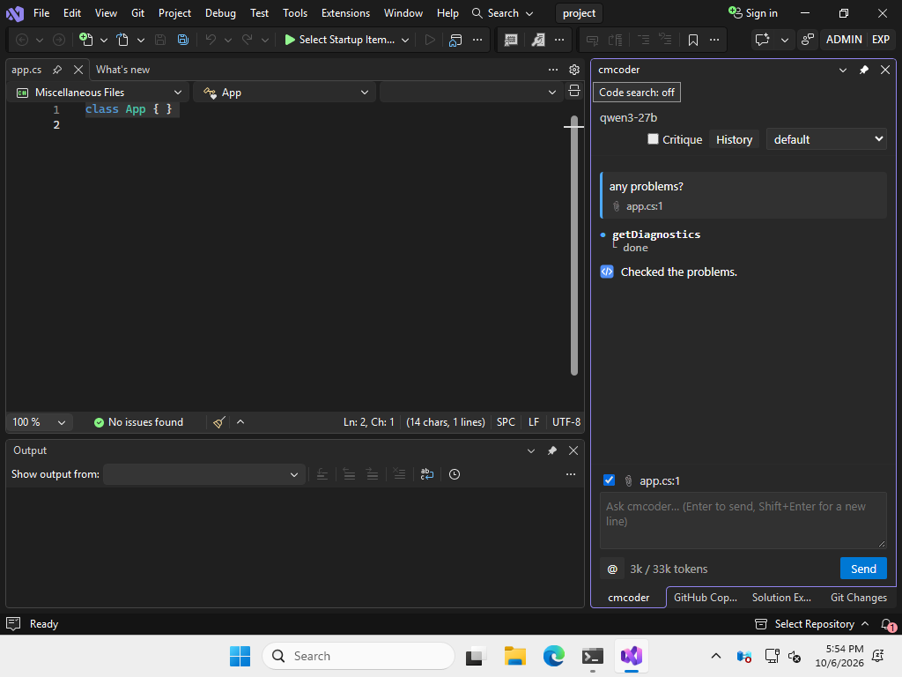
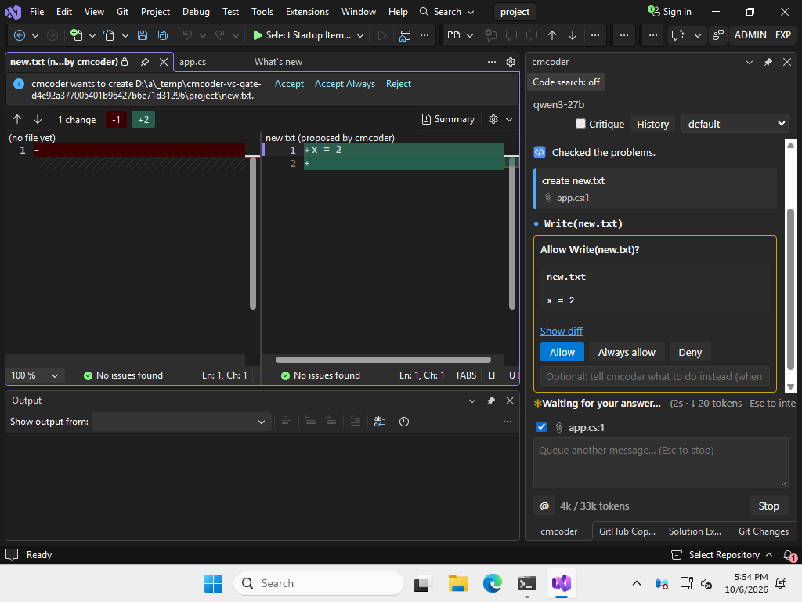
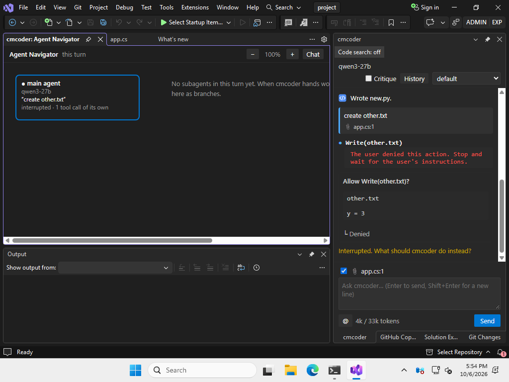

# cmcoder for Visual Studio: install and use

The Visual Studio extension is **one `.vsix` file** with cmcoder inside. You
don't need Python or the terminal package.



## What you need

| | |
|---|---|
| Visual Studio | **2022, version 17.10 or newer** (Community, Professional or Enterprise) on 64-bit Windows |
| Git for Windows | cmcoder runs commands with Git Bash |
| Microsoft Edge WebView2 Runtime | shows the chat; Visual Studio installs it |
| Network | access to your company's AI gateway (often: the VPN) |
| From your AI team | the gateway address, the model name, your API key |

## 1. Get the file

**`cmcoder-visualstudio-win32-x64.vsix`**. Your team shares it, or on GitHub go
to **Actions → Release build →** the latest green run **→ Artifacts**. There
it's called `cmcoder-visualstudio.vsix` and comes wrapped in a `.zip`: unzip
it. It's the same file.

## 2. Install

1. **Close Visual Studio.**
2. Double-click the `.vsix` file. The VSIX Installer opens.
3. Click **Install**. It says the file isn't signed (until your company signs
   it): confirm.
4. When it's done, close the installer and start Visual Studio.

## 3. First-time setup (once)

Skip this if your team did it for you: open the chat and ask something. If it
answers, you're done.

1. **The gateway.** Create `%USERPROFILE%\.cmcoder\settings.json` with what
   your AI team gives you:

   ```json
   {
     "providers": { "corp": { "baseUrl": "https://ai-gateway.example.com/v1" } },
     "model": "corp:qwen3-27b"
   }
   ```

2. **Your API key.** It's saved in Windows Credential Manager, never in a
   file. In Visual Studio, **Tools → cmcoder → Copy Diagnostics**, and paste
   it somewhere: the **Program:** line is the cmcoder inside the extension
   (ending in `bin\cmcoder\cmcoder.exe`). In a Command Prompt, run that
   program with `login` and paste your key (it isn't shown):

   ```
   "C:\…\bin\cmcoder\cmcoder.exe" login
   ```

   If you also use the terminal package, `cmcoder login` there does the same:
   the key is shared.

More (Open WebUI, certificates, proxies): [setup.md](setup.md).

## 4. Use

1. Open a solution or a folder (**File → Open → Folder**). cmcoder works in
   its folder.
2. **Tools → cmcoder → Open Chat**, or **Ctrl+Shift+Alt+C**. The chat docks
   next to Solution Explorer.
3. Type what you want and press **Enter** (**Shift+Enter** for a new line).
   For example: "explain this class", "add a unit test for Parse",
   "any problems in this file?".

cmcoder reads files on its own. **Before it changes a file or runs a command,
it asks you.**

### Review a change

The proposed change opens in Visual Studio's diff window: the file now on the
left, the proposal on the right. Choose **Accept**, **Accept Always** or
**Reject** in the bar above it, or answer in the chat: **Allow**, **Always
allow** (this kind of action in this solution, from now on) or **Deny** (with
a note telling cmcoder what to do instead).



### Everyday actions

| To | Do |
|---|---|
| Ask about some code | select it, then **Ctrl+Shift+Alt+K** or right-click → **Ask cmcoder About Selection** |
| See what goes with your message | the 📎 line above the input: the open file, the selection and its Error List entries. Untick it to leave them out once |
| Stop cmcoder | **Esc**, or **Stop** |
| Start over | **Tools → cmcoder → New Conversation** |
| Go back to an earlier conversation | **History** at the top of the chat |
| Change how much it asks | the picker at the top: **default** (ask) / **acceptEdits** / **plan** (read only) |
| A second check of each answer | tick **Critique** at the top |
| See background helpers (subagents) | **Tools → cmcoder → Open Agent Navigator** |
| Search code by meaning (big projects) | **Code search** above the chat, or **Tools → cmcoder → Code Search…** ([code-search.md](code-search.md)) |



*The Agent Navigator: the current turn and any helpers it started.*

Closing the solution stops cmcoder; so does closing Visual Studio, even if it
crashes. Your conversations are kept (**History**).

## Options

**Tools → Options → cmcoder**:

| Option | Meaning |
|---|---|
| cmcoder program | **leave empty**: the copy inside the extension is used |
| Permission mode at start | ask / accept edits / plan (read only) |
| Send the editor context | the open file, selection and errors (on) |
| Review changes in the diff window | (on) |
| Use the solution's own .cmcoder settings | off; switch on only for solutions you trust |

## Update or remove

- **Update:** close Visual Studio and install the new `.vsix` the same way.
- **Remove:** **Extensions → Manage Extensions → Installed →** cmcoder **→
  Uninstall**, then restart Visual Studio. Your settings, key and
  conversations stay in `%USERPROFILE%\.cmcoder`.

## If something's wrong

| Problem | Fix |
|---|---|
| The installer says Visual Studio is missing or too old | update Visual Studio 2022 to 17.10 or newer (Visual Studio Installer → Update) |
| The chat is blank | install the Microsoft Edge WebView2 Runtime |
| The program can't start | empty **cmcoder program** in the options |
| "Can't reach the gateway" | connect the VPN; check `baseUrl` in your settings file |
| "No API key" / 401 | run `login` again (step 3); keys expire |
| Certificate error | add your company's root certificate: [setup.md](setup.md) |
| Commands fail: "Git Bash not found" | install Git for Windows, restart Visual Studio |
| Antivirus blocks `cmcoder.exe` | ask IT to allow it |

For help, use **Tools → cmcoder → Copy Diagnostics** and **Show Log**, and
send both (your key is never in them). More:
[troubleshooting.md](troubleshooting.md).
