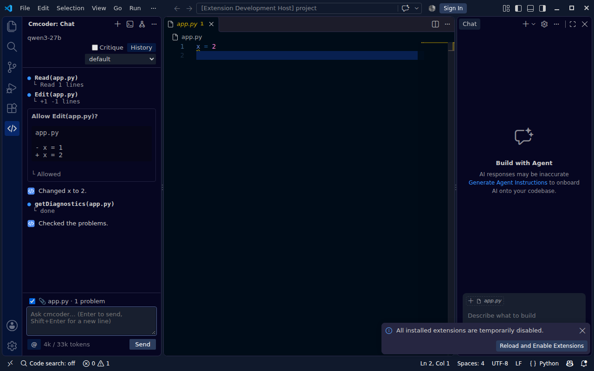
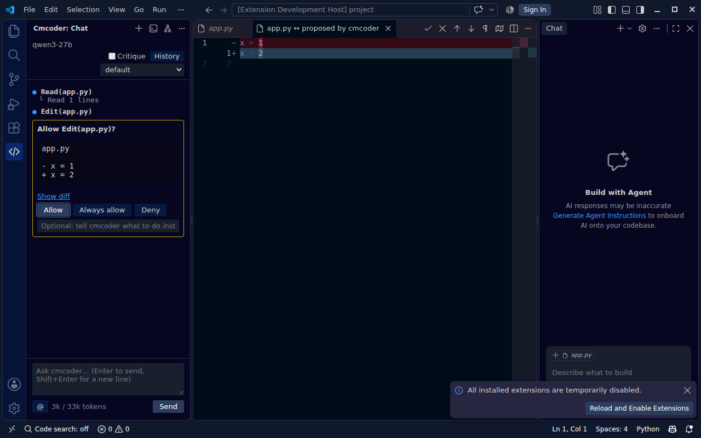
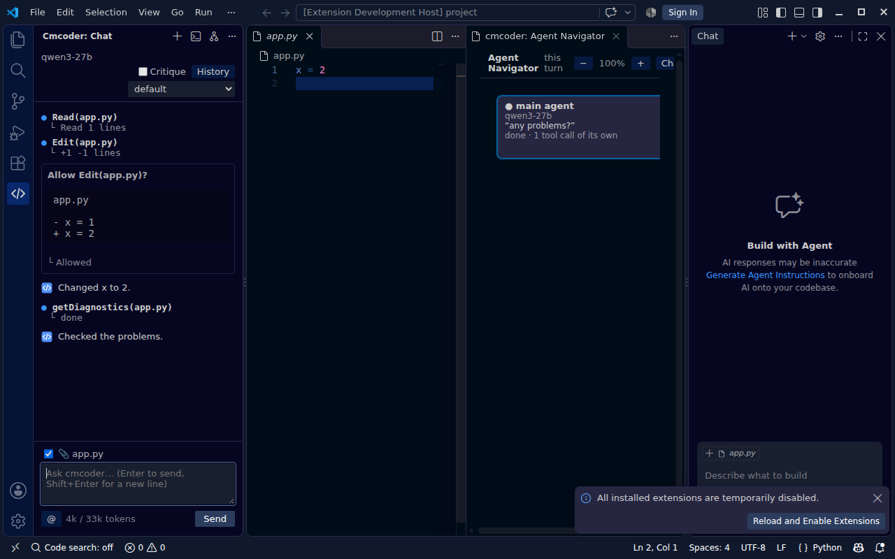

# cmcoder for VS Code: install and use

The VS Code extension is **one `.vsix` file** with cmcoder inside. You don't
need Python, uv, Node.js or the terminal package.



## What you need

| | |
|---|---|
| VS Code | **1.90 or newer** |
| Windows | **Git for Windows** (cmcoder runs commands with Git Bash) |
| Network | access to your company's AI gateway (often: the VPN) |
| From your AI team | the gateway address, the model name, your API key |

## 1. Get the file

Take the file for your computer. Your team shares them, or on GitHub go to
**Actions → Release build →** the latest green run **→ Artifacts**. GitHub
wraps each download in a `.zip`: unzip it to get the file.

| Your computer | File |
|---|---|
| Windows | `cmcoder-win32-x64.vsix` |
| Mac (Apple silicon) | `cmcoder-darwin-arm64.vsix` |
| Linux | `cmcoder-linux-x64.vsix` |

## 2. Install

1. In VS Code, open **Extensions** (Ctrl+Shift+X).
2. Click **⋯** (top right of the Extensions panel) → **Install from VSIX…**,
   and choose the file.
3. Reload VS Code if it asks.

Or in a terminal: `code --install-extension cmcoder-win32-x64.vsix`.

The cmcoder icon appears in the activity bar on the left.

## 3. First-time setup (once)

Skip this if your team did it for you: open the chat and ask something. If it
answers, you're done.

1. **The gateway.** Create `%USERPROFILE%\.cmcoder\settings.json` (Windows) or
   `~/.cmcoder/settings.json` (macOS, Linux) with what your AI team gives you:

   ```json
   {
     "providers": { "corp": { "baseUrl": "https://ai-gateway.example.com/v1" } },
     "model": "corp:qwen3-27b"
   }
   ```

   **cmcoder: Open Settings File** in the Command Palette opens this file.

2. **Your API key.** It's saved in your operating system's keychain, never in
   a file. Open a terminal and run the cmcoder inside the extension with
   `login`, then paste the key (it isn't shown):

   - Windows:
     `%USERPROFILE%\.vscode\extensions\cmcoder.cmcoder-<version>-win32-x64\bin\cmcoder\cmcoder.exe login`
   - macOS, Linux:
     `~/.vscode/extensions/cmcoder.cmcoder-<version>-<platform>/bin/cmcoder/cmcoder login`

   If you also use the terminal package, `cmcoder login` there does the same:
   the key is shared.

More (Open WebUI, certificates, proxies): [setup.md](setup.md).

## 4. Use

1. Open your project folder (**File → Open Folder**). cmcoder works in it.
2. Click the cmcoder icon in the activity bar, or press **Ctrl+Alt+K**
   (Mac: Cmd+Alt+K).
3. Type what you want and press **Enter** (**Shift+Enter** for a new line).
   For example: "explain how login works", "add a test for parse_date",
   "any problems in this file?".

cmcoder reads files on its own. **Before it changes a file or runs a command,
it asks you.**

### Review a change

The proposed change opens in VS Code's diff editor. Accept it with **✓** or
reject it with **✕** in the diff's title bar, or answer in the chat:
**Allow**, **Always allow** (this kind of action in this project, from now
on) or **Deny** (with a note telling cmcoder what to do instead).



### Everyday actions

| To | Do |
|---|---|
| Ask about some code | select it, then **Ctrl+Alt+L** (Mac: Cmd+Alt+L) or right-click → **Ask cmcoder About Selection** |
| See what goes with your message | the 📎 line above the input: the open file, the selection and its problems. Untick it to leave them out once |
| Mention another file | the **@** button |
| Show an image (a screenshot, an error dialog) | **Ctrl+V** in the input, drop the file on the chat, or the **Image** button ([images.md](images.md)) |
| Stop cmcoder | **Esc**, or **Stop** |
| Start over | **cmcoder: New Conversation** |
| Go back to an earlier conversation | **History** at the top of the chat; **Continue Last Conversation** in the chat's **⋯** menu |
| Change how much it asks | the picker at the top: **default** (ask) / **acceptEdits** / **plan** (read only) |
| A second check of each answer | tick **Critique** at the top |
| See background helpers (subagents) | **cmcoder: Open Agent Navigator** |
| Search code by meaning (big projects) | the status bar item, or **cmcoder: Set Up Code Search** ([code-search.md](code-search.md)) |
| Use the terminal version | **cmcoder: Open in Terminal** |

All commands start with **cmcoder:** in the Command Palette (Ctrl+Shift+P).



*The Agent Navigator: the current turn and any helpers it started.*

## Settings

**File → Preferences → Settings**, search for "cmcoder":

| Setting | Meaning |
|---|---|
| `cmcoder.permissionMode` | the permission mode for new conversations |
| `cmcoder.diffReview` | show proposed changes in the diff editor (on) |
| `cmcoder.autoContext` | send the open file, selection and problems (on) |
| `cmcoder.executable`, `cmcoder.executableArgs` | **leave these alone**: they're for cmcoder's own developers and need Python |

A project's own `.cmcoder` settings are used only when VS Code trusts the
folder (**Manage Workspace Trust**). A project can never change the gateway.

## Update or remove

- **Update:** install the new `.vsix` the same way.
- **Remove:** Extensions → cmcoder → **Uninstall**. Your settings, key and
  conversations stay in `~/.cmcoder`.

## If something's wrong

| Problem | Fix |
|---|---|
| "couldn't start", mentioning `uv` or Python | remove the `cmcoder.executable` and `cmcoder.executableArgs` settings |
| "Can't reach the gateway" | connect the VPN; check `baseUrl` in your settings file |
| "No API key" / 401 | run `login` again (step 3); keys expire |
| Certificate error | add your company's root certificate: [setup.md](setup.md) |
| Commands fail on Windows: "Git Bash not found" | install Git for Windows, restart VS Code |

For help, run **cmcoder: Show Log** and send the log (your key is never in
it). More: [troubleshooting.md](troubleshooting.md).
